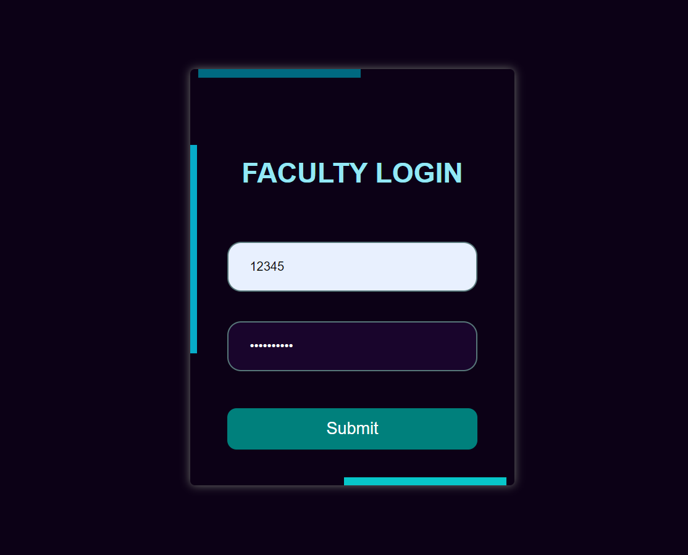
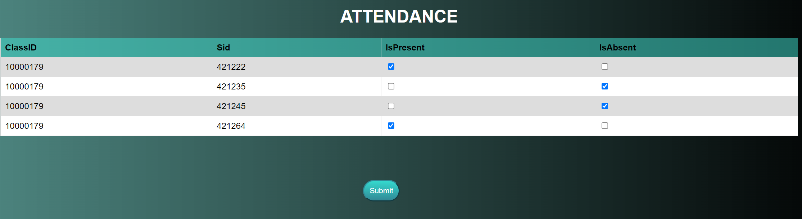
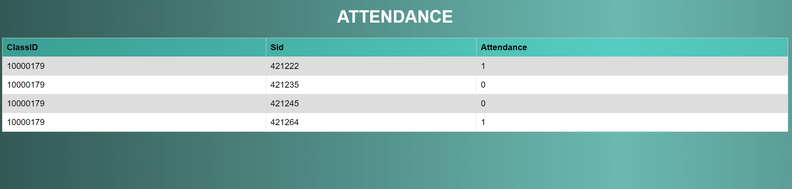
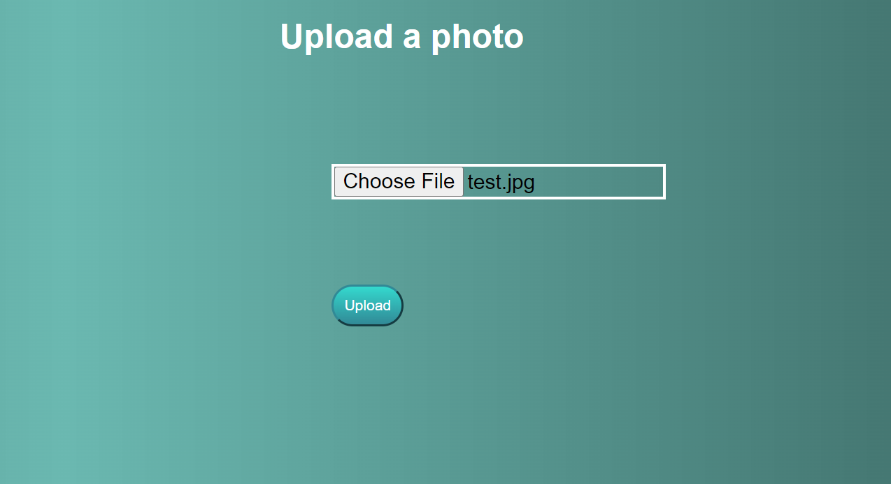
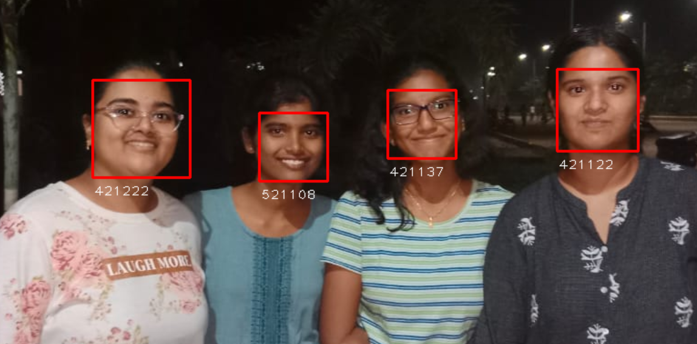
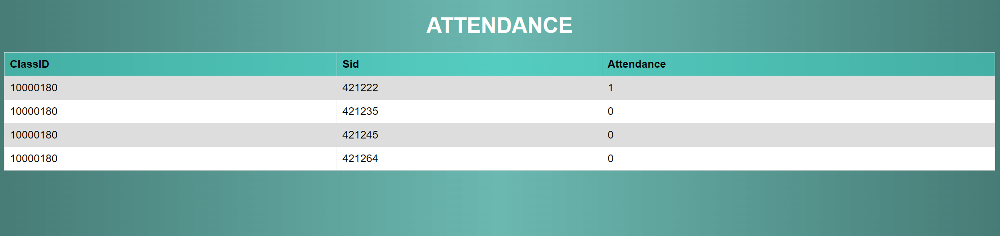
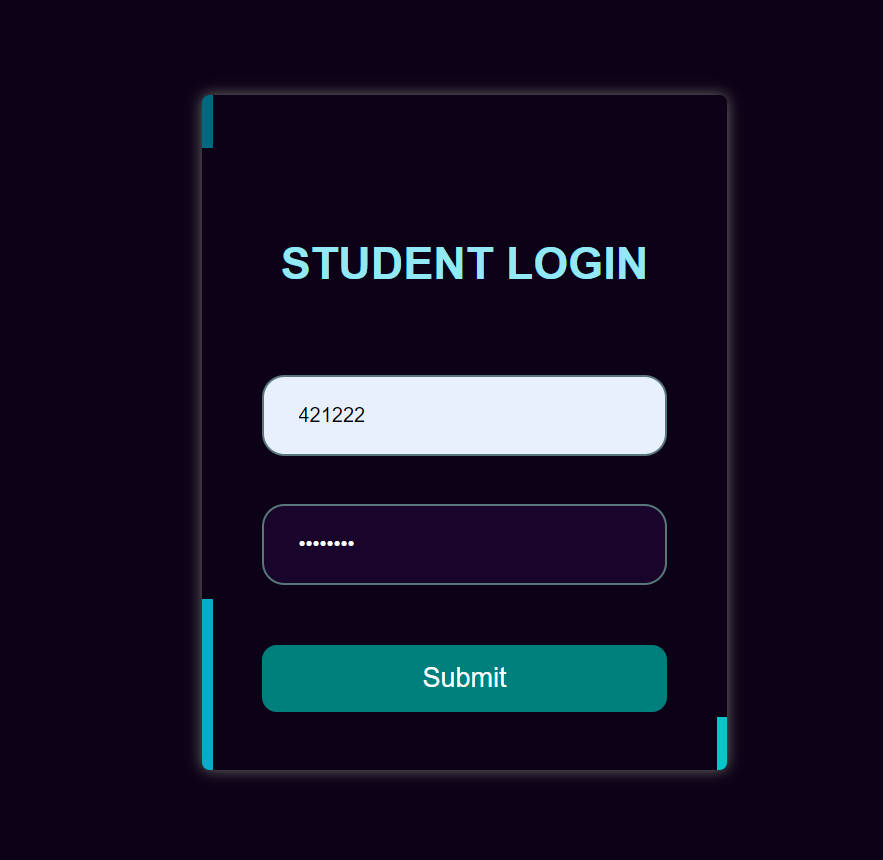
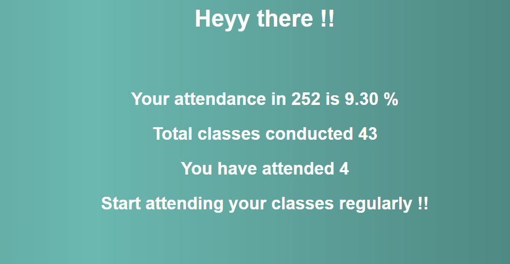
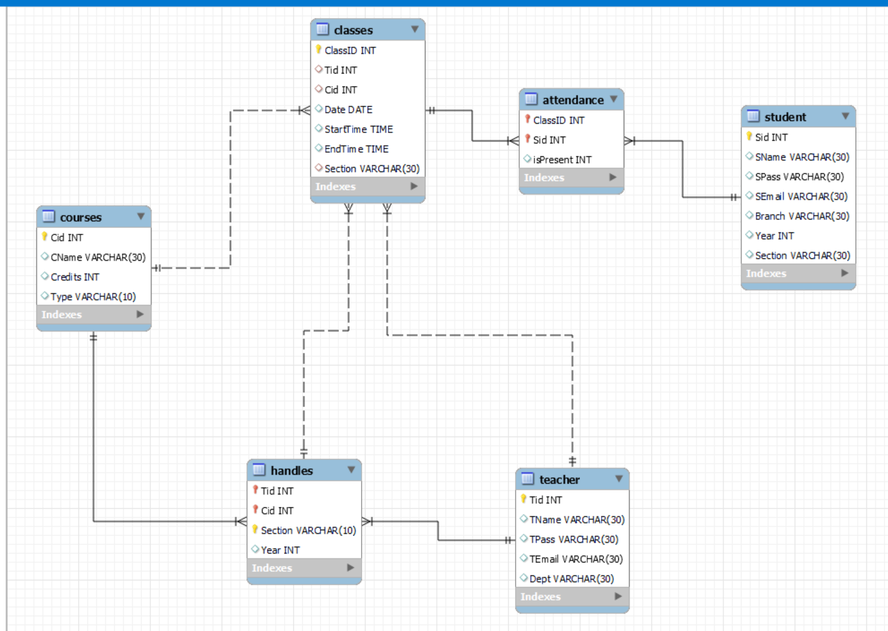

# OnlineAttendanceSystem
This Online Attendance System helps in easy attendance recording and tracking .

We know that Attendance Percentage is strictly observed by the Administration before they give students the
permission to write the exams. Since it is a very important aspect there should be no mistakes in regarding to
a student’s attendance. In order to make the Attendance system work with more accuracy we came up with this
website. The website aims to simplify the process of Tracking Attendance of Students and our website enables
Students to check their attendance percentage on a daily basis. The website holds the information of all the students
and the faculty and the courses and sections being taught by the faculty. By using this system Institutions can
automate the attendance related tasks easily and save time and resources. The website facilitates the efficient
management of the attendance related data. The website enables the faculty to login to their account and select
their respective course for a particular section and give attendance to the students present. It keeps record of the
students present or absent for a course based on date, section, branch and year.

Here are the images of the website :

Home Page

 Faculty Login Page
 
 
 Faculty Profile Page
 
 
 Create Class Page
 
 
 Manual Attendance Page
 
 
 Attendance View Page
 
 
 Upload Page
 
 
 Recognized Faces
 
 
 Attendance View Page
 
 
 Student Login Page
 
 
 Student Profile Page
 
 
 Student Attendance Page
 
 
 Here is the ER diagram for the database :
 
